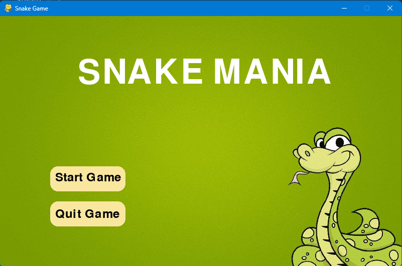
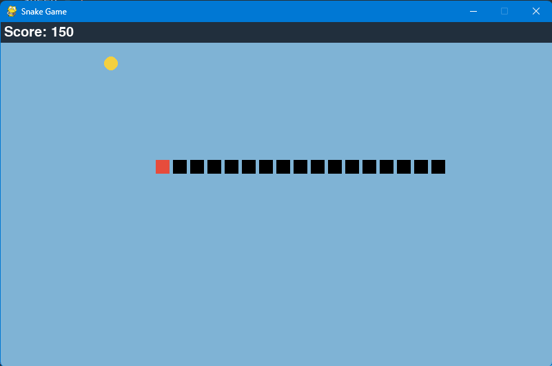

# 🐍 Snake Mania

A classic Snake Game built using **Python** and **Pygame**, featuring a graphical menu, sound effects, score tracking, increasing difficulty, and collision detection.

## 📸 Preview

The game starts with a custom home screen where players can:

* Start the game
* Quit the game

During gameplay:

* Control the snake using arrow keys
* Eat food to increase score and snake length
* Avoid colliding with walls and your own body
* Experience increasing speed as your score grows

---

## 🎮 Features

* Interactive start menu
* Score tracking system
* Sound effect when food is eaten
* Increasing game speed based on score
* Self-collision detection
* Border collision detection
* Game over screen with restart option
* Custom background image support

---

## 🛠️ Requirements

* Python 3.x
* Pygame

Install Pygame using:

```bash
pip install pygame
```

---

## 📂 Project Structure

```text
Snake-Mania/
│
├── main.py
├── first.jpg
├── food_eat_sound.mp3
├── README.md
└── assets/
```

### Required Files

| File                 | Purpose                               |
| -------------------- | ------------------------------------- |
| `main.py`            | Main game source code                 |
| `first.jpg`          | Background image used on intro screen |
| `food_eat_sound.mp3` | Sound played when food is eaten       |

---

## 🚀 Running the Game

1. Clone the repository:

```bash
git clone https://github.com/yourusername/snake-mania.git
```

2. Navigate to the project folder:

```bash
cd snake-mania
```

3. Run the game:

```bash
python main.py
```

---

## 🎯 Controls

| Key   | Action                  |
| ----- | ----------------------- |
| ↑     | Move Up                 |
| ↓     | Move Down               |
| ←     | Move Left               |
| →     | Move Right              |
| Enter | Restart after Game Over |

---

## 📈 Scoring System

* Each food item eaten gives **10 points**.
* Snake length increases after eating food.
* Every **50 points**, game speed increases to make gameplay more challenging.

---

## 💀 Game Over Conditions

The game ends when:

1. The snake collides with the border.
2. The snake collides with its own body.

After game over, press **Enter** to restart.

---

## 🔧 Built With

* Python
* Pygame

---

## 📚 Concepts Used

* Event handling
* Game loops
* Collision detection
* List manipulation
* Randomized object spawning
* Graphics rendering with Pygame
* Audio playback

---

## 📸 Application Screenshots

<p align="center">
  
</p>

<p align="center">
  
</p>

---

## 🤝 Contributing

Contributions, bug reports, and feature suggestions are welcome.

1. Fork the repository
2. Create a feature branch
3. Commit your changes
4. Open a Pull Request

---

## 📜 License

This project is open-source and available under the MIT License.

---

## 👨‍💻 Author

Created as a Python & Pygame learning project.

Feel free to modify and improve the game!
